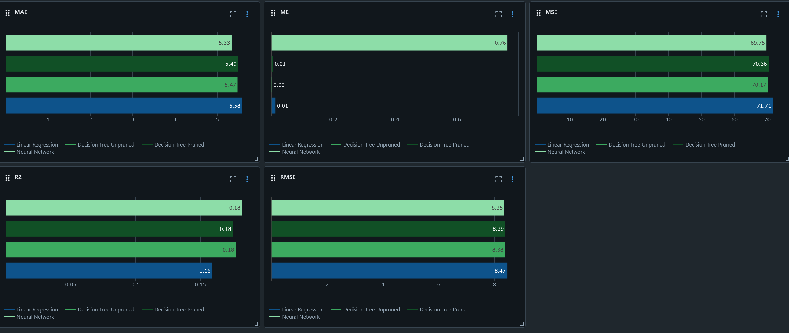

## Project Description
This project aims to predict the dropout percentage that a particular demographic would be subject to given various limited features available.

## Data
One of the most important part of this project is the Data collection, Exploratory Data Analysis, and feature selection. Regarding collection this data was sourced from New York State Educational System from two separate datasets.

## Considerations

## Methodology

## Tracking
For model tracking and analysis I used MLFlows Model feature so that I can easily compare models and show proficiency in the ability to work in a shared environment with other Data Scientist in a development capacity. Below are some screenshots of the final run results utilizing MLFLow to guide our analysis and prediction power. 

## Final Conclusion